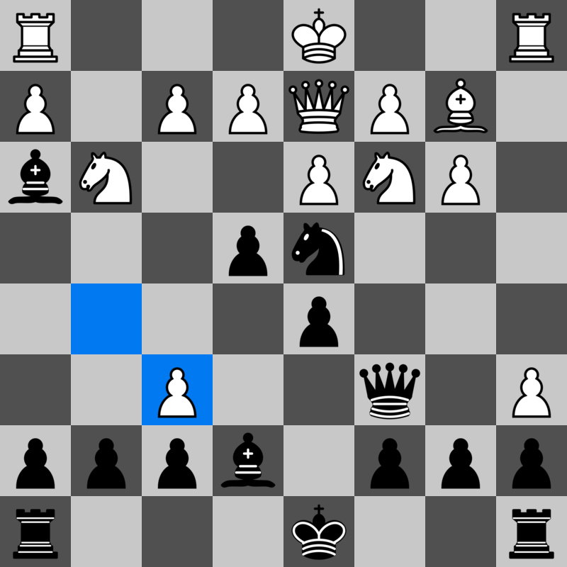

# Chess

- [x] gui
  - [x] move input
  - [x] highlighting 
- [x] move gen
  - [x] regular moves
  - [x] check
  - [x] castling
  - [x] pawn promotion
  - [x] en passant
- [ ] AI
  - [ ] evaluation
    - [ ] pieces
	- [ ] center
	- [ ] moves
	- [ ] checkmate
	- [ ] unsafe pieces
  - [ ] minimax search
  - [ ] alfa beta pruning
  - [ ] moves sort

