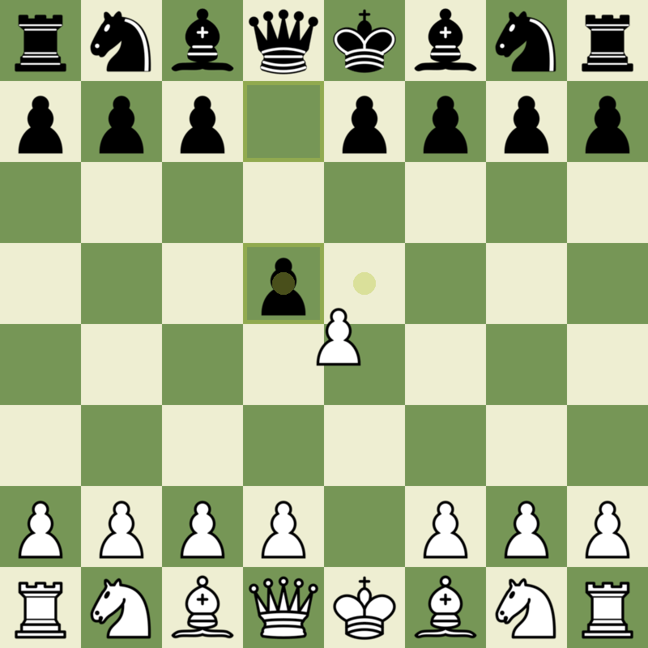

# Chess

- [ ] gui
  - [x] move input
  - [ ] printing search stats
  - [x] highlighting 
- [ ] move gen
  - [x] regular moves
  - [x] check/mate logic
  - [ ] castling
  - [x] pawn promotion (queen only)
  - [ ] en passant
- [ ] AI
  - [ ] evaluation
    - [ ] pieces
	- [ ] center
	- [ ] moves
	- [ ] checkmate
	- [ ] unsafe pieces
  - [ ] minimax search
  - [ ] alfa beta pruning
  - [ ] moves sort
  - [ ] search on another thread
  - [ ] multithreading

